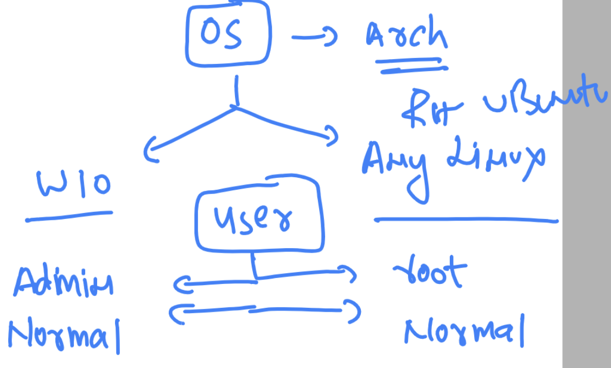

##
### OS architecture 



### PUll alpine docker image

```
docker    pull    alpine 
```

### creating one os with some name 

```
docker  run --name  ashuos1 -itd  --restart always alpine
```

### LInux basic commands 

### 

```
$ whoami
webmaster
$ uname
Linux
$ date
export "PS1=$ "
date

Wed May 17 15:18:14 IST 2023
export "PS1=$ "

```

### Directory structure os 


